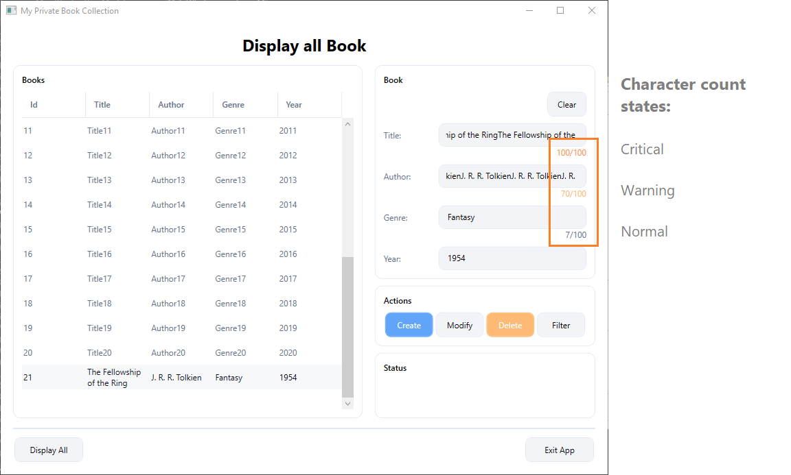
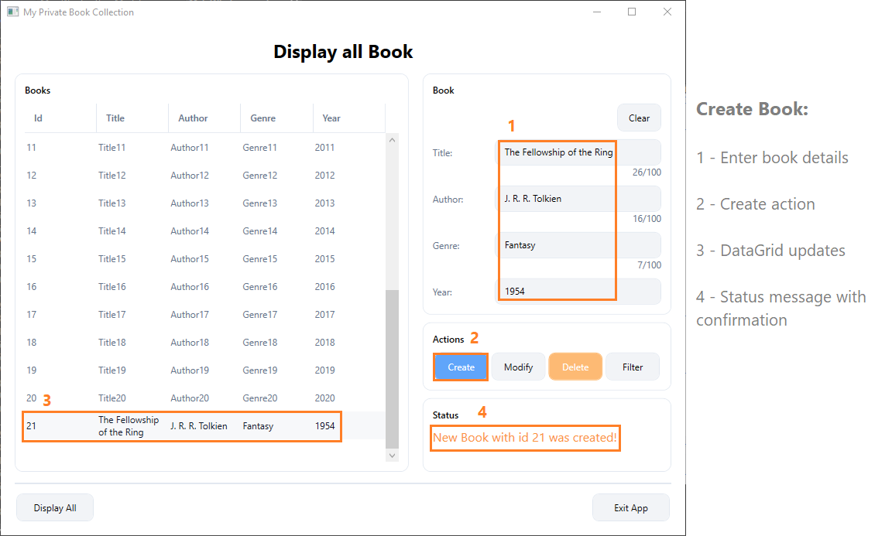

# My Private Book Collection

This is a WPF desktop application built with C# (.NET Framework 4.8) to manage a private book collection.

The main goal of this project was to practice clean architecture, MVVM structure, reusable styling, and state-driven UI behavior.

---

## Overview

The application allows users to:

- Display all books in a DataGrid
- Create new book entries
- Modify existing books
- Delete books
- Filter books
- Receive live input validation feedback

The project focuses on structure, separation of concerns, and clear UI logic rather than complex external integrations.

---

## Project Structure

The solution is organized into the following folders:

- **Commands** – Contains the `RelayCommand` implementation
- **Model** – Core entity (`Book`) and validation logic
- **Repositories** – Data access abstraction (`IBookRepository`, `BookRepository`)
- **View** – XAML UI files
- **ViewModel** – Application logic and state handling

Generic styles and reusable UI definitions are defined centrally in **App.xaml**.

---

## Preview

### Character Count States

This screenshot shows the dynamic input counter logic.  
Each input field provides live character tracking with three visual states:

- Normal
- Warning
- Critical

The state logic is handled in the ViewModel, while the visual representation is defined in XAML using reusable styles.

  

---

### Create Book Workflow

This screenshot demonstrates the book creation process.

After entering book details and clicking the Create button:

- The DataGrid updates immediately
- A status message confirms the action
- Input validation and state handling remain active

  

---

## Technical Focus

In this project I practiced:

- MVVM architecture
- ICommand implementation
- Repository pattern
- Data binding
- Dependent property updates
- Reusable styles and ControlTemplates
- State-based UI feedback
- Clean layout structure

---

## Technologies Used

- C#
- WPF
- .NET Framework 4.8
- MVVM Pattern
- XAML Styling
- DataGrid customization

---

## Purpose

This project represents my current level as a junior developer and my effort to build structured, maintainable desktop applications with clear separation between UI and business logic.
